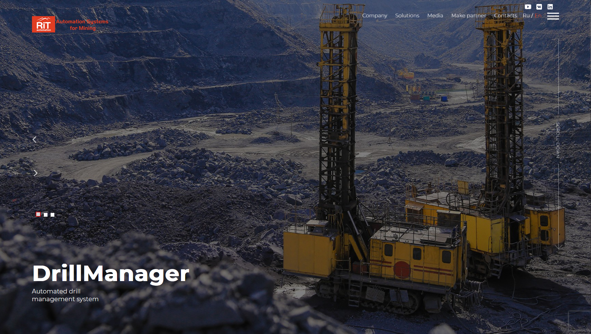
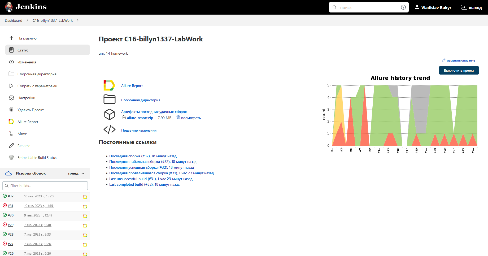
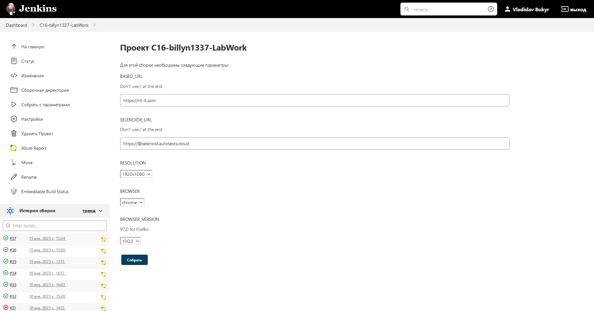
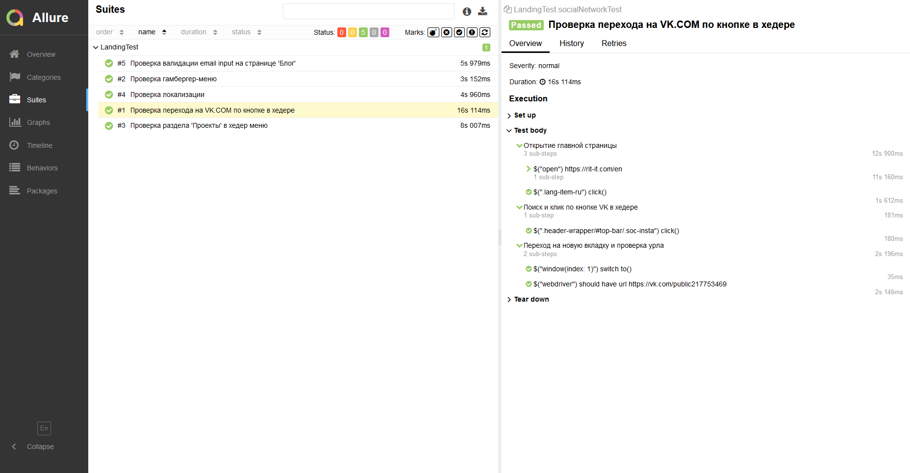
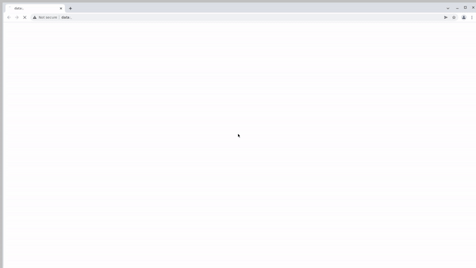
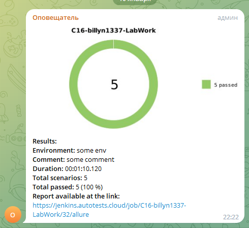

<h1 align="center">Демопроект UI автоматизации на примере <a href="https://rit-it.com/en/ ">rit-it.com</a></h1>

<p align="center">

</p>

<h3>Содержание:</h3>


0. [Технологии](#tech)
1. [Список проверок](#listOFTest)
2. [Запуск тестов и ветки](#testLaunch)
   1. [Запуск в Jenkins](#jenkinsLaunch)
   2. [Запуск тестов с использованием .properties](#ownerLaunch)
3. [Отчетность](#report)
   1. [Allure](#allureReport)
   2. [Telegram](#telegramReport)


<h3 id="tech">Технологии</h3>
<hr>
<p align="center">
<code><a href="https://www.java.com/"></a></code>
<code><a href="https://junit.org/junit5/"></a></code>
<code><a href="https://selenide.org/"></a></code>
<code><a href="https://gradle.org/"></a></code>
<code><a href="https://github.com/"></a></code>
<code><a href="https://aerokube.com/selenoid/"></a></code>
<code><a href="https://www.jenkins.io/"></a></code>
<code><a href="https://github.com/allure-framework/allure2"></a></code>


- Написано на <code><strong>Java</strong></code> <br />
- Протестировано с помощью <code><strong>jUnit</strong></code> и <code><strong>Selenide</strong></code> <br />
- Собрано <code><strong>Gradle</strong></code> <br />
- Хранится в <code><strong>GitHub</strong></code> <br />
- Запускается в <code><strong>Jenkins</strong></code> и <code><strong>Selenoide</strong></code> <br />
- Отчитывается в <code><strong>Allure</strong></code> и <code><strong>Telegram</strong></code> <br />

<h3 id="listOFTest">Список проверок</h3>
<hr>

- [x] Проверка смены локализации (Ru, En) <br />
- [x] Проверка валидации input полей на примере поля e-mail <br />
- [x] Проверка ссылок на социальные сети<br />
- [x] Проверка Hamburger Menu <br />
- [x] Проверка Header Menu <br />

<h3 id="testLaunch">Запуск тестов и ветки:</h3>
<hr />

<h4 id="jenkinsLaunch">Запуск в Jenkins</h4>

Ветка <code>master</code> настроена на запуск в Jenkins

>Параметризированная джоба в Jenkins со статистикой сборок
>



Пример таски для запуска в Jenkins:
```bash
clean
test
-D"baseUrl=${BASED_URL}"
-D"selenoideURL=${SELENOIDE_URL}"
-D"resolution=${RESOLUTION}"
-D"browser=${BROWSER}"
-D"browserVersion=${BROWSER_VERSION}"
```
Расшифровка
><code>test</code> - запуск всех тестов<br />
><code>${BASED_URL}"</code> - задает URL стенда<br />
><code>${SELENOIDE_URL}"</code> - задает URL селеноида <br />
><code>${RESOLUTION}"</code>  - задает разрешение браузера <br />
><code>${BROWSER}"</code> - выбор браузер <br />
><code>${BROWSER_VERSION}"</code> - выбор версии браузера <br />


<h4 id="ownerLaunch">Запуск тестов с использованием .properties</h4>

Ветка <code>owner</code> использует одноменную библиотеку для хранения конфигураци запуска тестов, в т.ч. секретных данных. <br />

Пример файла local.properties:
```bash
baseUrl = https://rit-it.com
resolution = 1920x1080
browser = chrome
browserVersion = 100.0

isRemote=false
```

Локальный запуск тестов:
```bash
gradle clean test -Denv=local
```

Удаленный запуск тестов на Selenoide
```bash
gradle clean test -Denv=remote
``` 

<h3 id="report">Отчетность</h3>
<hr />
<h4 id="allureReport">Allure</h4>

Команда для формирования отчета вне Jenkins
```bash
gradle allureServe
```


>Аллюр отчет с подробными аннотациями шагов теста и вложениями
>


>К каждому прогону записывается видео
>

<h4 id="telegramReport">Telegram</h4>

>Уведомления в Telegram о завершенных сборках с сылкой на Allure-отчет из Jenkins
>



